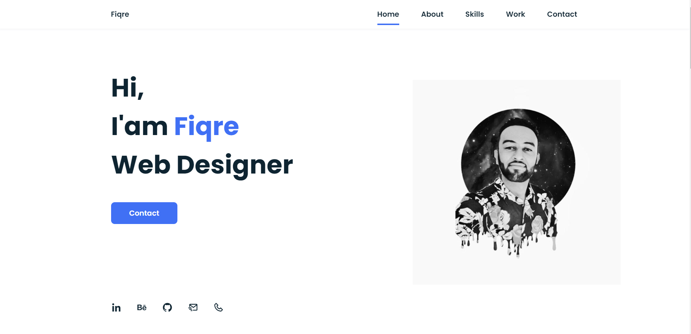

# Fiqre Portfolio

Welcome to my portfolio! This project showcases my work and skills as a web developer/designer.

## Table of Contents

- [About](#about)
- [Features](#features)
- [Screenshots](#screenshots)
- [Technologies Used](#technologies-used)
- [Getting Started](#getting-started)
- [Usage](#usage)
- [Contributing](#contributing)
- [License](#license)

## About

This portfolio is a collection of projects, designs, and code samples that represent my journey and skills as a web developer. It provides a glimpse into my experience and expertise in the field of web development.

## Features

- List the key features and highlights of your portfolio.

## screenshots

## Technologies Used

- HTML
- CSS
- JavaScript

## Getting Started

If you want to explore or run this portfolio locally

bash
Copy code
cd portfolio
Open the index.html file in your web browser to view the portfolio.

Usage
You can navigate through my portfolio to view the various projects and designs I've worked on. Feel free to explore the different sections and interact with the content. If you have any questions or would like to get in touch with me, you can find my contact information on the portfolio website.

Contributing
I welcome contributions and feedback from the community. If you'd like to contribute to this project, please follow these guidelines:

Fork the repository.
Create a new branch for your feature or bug fix: git checkout -b feature-name.
Make your changes and commit them: git commit -m 'Add new feature'.
Push to the branch: git push origin feature-name.
Create a pull request on GitHub.
Please ensure that your contributions align with the purpose and style of this portfolio.

## License

License: This project is licensed by fiqre

